# Agentic AI STLC Pipeline

[](https://github.com/beepakbehera/agentic-ai-stlc-pipeline/actions/workflows/agentic_tests.yml)
[](https://www.python.org/downloads/)
[](https://nodejs.org/)
[](LICENSE)

> **Production-ready, modular AI-driven Software Testing Life Cycle (STLC) pipeline** powered by **LangGraph**, **NVIDIA Nemotron 3 Ultra 550B**, **Jira Cloud REST API v3**, and **GitHub Actions CI/CD**.

## 🎯 Overview

This pipeline automates the complete Software Testing Life Cycle using a multi-agent architecture:

```mermaid
graph LR
    A[Requirements] --> B[1. RAG Retrieval]
    B --> C[2. Test Authoring<br/>Agent 1: Nemotron]
    C --> D[3. Script Generation<br/>Agent 2: Nemotron]
    D --> E[4. Selector Healing<br/>Agent 2b: MCP + Nemotron]
    E -->|healed locators| D
    E -->|no healing| F[5. CI/CD Execution<br/>Agent 3: GitHub Actions]
    F --> G[6. Failure Analysis<br/>Agent 4: Nemotron + Jira]
    G --> H[Jira Defects + Reports]
```



> **Self-healing feedback loop:** when Agent 2b heals broken locators, the healed
> locators are automatically fed back to **Stage 3 (Script Generation)**, the
> scripts are patched and re-generated, and the flow continues to execution.
> The loop is capped by `max_healing_rounds` (default 3) to guarantee termination.

### 6 Stages

| Stage | Agent | Technology | Purpose |
|-------|-------|------------|---------|
| 1 | RAG Retrieval | ChromaDB + Sentence Transformers | Retrieve relevant context from vector DB |
| 2 | Test Authoring | Nemotron 3 Ultra 550B | Generate comprehensive test cases |
| 3 | Script Generation | Nemotron 3 Ultra 550B | Generate Playwright TypeScript & Robot Framework |
| 4 | Selector Healing | MCP + Nemotron 3 Ultra 550B | Self-heal flaky selectors, loop back to Stage 3 to apply healed locators |
| 5 | CI/CD Trigger | GitHub Actions REST API | Dispatch & monitor workflow runs |
| 6 | Failure Analysis | Nemotron 3 Ultra 550B + Jira | Analyze failures & create defects |

## 🚀 Quick Start

### Prerequisites

- Python 3.11+
- Node.js 20+
- Git
- NVIDIA Nemotron API key ([get one](https://build.nvidia.com/explore/discover))
- Jira Cloud account with API token
- GitHub Personal Access Token

### Installation

```bash
# Clone repository
git clone https://github.com/beepakbehera/agentic-ai-stlc-pipeline.git
cd agentic-ai-stlc-pipeline

# Create virtual environment
python -m venv .venv
source .venv/bin/activate  # Windows: .venv\Scripts\activate

# Install Python dependencies
pip install -r requirements.txt

# Install Playwright browsers
playwright install --with-deps chromium

# Install Node.js dependencies
npm install
npx playwright install --with-deps chromium
```

### Configuration

```bash
# Linux/macOS:
cp .env.example .env

# Windows (PowerShell):
Copy-Item .env.example .env

# Edit .env with your credentials and target application URL:
# BASE_URL=https://www.saucedemo.com/
# NEMOTRON_API_KEY, JIRA_*, GITHUB_TOKEN
```

### Run Pipeline

#### 1. Quickest Run (Zero-Config / Defaults from `.env`)
Runs automatically against the `BASE_URL` defined in `.env` (default: `https://www.saucedemo.com/`):

```bash
# Live execution (calls Nemotron and Jira APIs)
python main.py

# Offline Mock mode (instant execution, no API keys needed)
python main.py --mock
```

#### 2. Run with Custom Test Scenarios

**Windows (PowerShell):**
```powershell
python main.py `
  --requirements "User authentication, inventory search, add item to cart, and checkout" `
  --acceptance-criteria "Valid login succeeds and redirects to inventory; invalid credentials display error alert" `
  --app-context "Swag Labs at https://www.saucedemo.com/"
```

**Linux / macOS (Bash):**
```bash
python main.py \
  --requirements "User authentication, inventory search, add item to cart, and checkout" \
  --acceptance-criteria "Valid login succeeds and redirects to inventory; invalid credentials display error alert" \
  --app-context "Swag Labs at https://www.saucedemo.com/"
```

#### 3. Additional Execution Commands
```bash
# Run with a JSON configuration file
python main.py --config pipeline_config.json

# Visualize the 6-stage LangGraph workflow graph
python main.py --visualize

# Ingest documentation for Stage 1 RAG retrieval
python main.py --ingest-documents ./docs/

# Enable verbose DEBUG logging
python main.py --log-level DEBUG --mock
```

#### CLI Options

| Option | Description |
|--------|-------------|
| `--requirements` | Requirements/user stories text |
| `--acceptance-criteria` | Acceptance criteria text |
| `--app-context` | Application under test context |
| `--config` | Path to JSON config file |
| `--mock` | Run in mock mode (skip real API calls) |
| `--log-level` | Logging level (DEBUG, INFO, WARNING, ERROR) |
| `--pipeline-id` | Unique pipeline identifier |
| `--run-id` | Unique run identifier |
| `--git-ref` | Git reference (branch/tag/SHA) |
| `--environment` | Target environment (staging, production) |
| `--max-retries` | Maximum retries for failed stages |
| `--pipeline-timeout` | Pipeline timeout in seconds |
| `--visualize` | Print pipeline graph visualization and exit |
| `--ingest-documents` | Path to documents for RAG ingestion |

## 📁 Project Structure

```
agentic-ai-stlc-pipeline/
├── .github/workflows/
│   └── agentic_tests.yml       # GitHub Actions CI/CD
├── config/
│   ├── settings.py             # Pydantic settings management
│   └── prompt_templates.py     # Nemotron prompts for all 4 agents
├── src/
│   ├── __init__.py
│   ├── state.py                # AgenticSTLCState TypedDict
│   ├── graph.py                # LangGraph compilation
│   ├── jira_client.py          # Jira REST API v3 wrapper
│   └── nodes/
│       ├── rag_retrieval.py    # Stage 1: Vector DB/RAG
│       ├── agent1_test_author.py      # Stage 2: Test Authoring
│       ├── agent2_script_gen.py       # Stage 3: Script Gen
│       ├── agent2b_mcp_heal.py        # Stage 4: Selector Healing
│       ├── agent3_cicd_trigger.py     # Stage 5: CI/CD Trigger
│       └── agent4_defect_logger.py    # Stage 6: Jira Defects
├── tests/
│   ├── e2e_sample.spec.ts      # Playwright sample
│   ├── sample.robot            # Robot Framework sample
│   ├── pages/                  # Page Objects
│   ├── fixtures/               # Test data
│   ├── resources/              # Robot keywords
│   └── variables/              # Robot variables
├── main.py                     # Entry point
├── requirements.txt            # Python dependencies
├── package.json                # Node.js dependencies
├── .env.example                # Environment template
└── .gitignore
```

## 🔧 Configuration

### Environment Variables

| Variable | Required | Description |
|----------|----------|-------------|
| **Application Under Test** | | |
| `BASE_URL` | | Base URL for the web application under test (default: `https://www.saucedemo.com/`) |
| `API_URL` | | REST API URL for test requests |
| `BROWSER` | | Browser engine for test execution (`chromium`, `firefox`, `webkit`) |
| `HEADLESS` | | Run browser in headless mode (`true` / `false`) |
| `ENVIRONMENT` | | Target environment (`staging`, `production`, `development`) |
| **NVIDIA Nemotron 3 Ultra** | | |
| `NEMOTRON_API_KEY` | ✅ | NVIDIA Nemotron API key (from NVIDIA NGC / Build) |
| `NEMOTRON_BASE_URL` | | API Base URL (default: `https://integrate.api.nvidia.com/v1`) |
| `NEMOTRON_MODEL` | | Model name (default: `nvidia/nemotron-3-ultra`) |
| `NEMOTRON_TEMPERATURE` | | Generation temperature (default: `0.1`) |
| `NEMOTRON_MAX_TOKENS` | | Max response token length (default: `8192`) |
| **Jira Cloud REST API v3** | | |
| `JIRA_BASE_URL` | ✅ | Jira Cloud instance URL (e.g. `https://your-domain.atlassian.net`) |
| `JIRA_EMAIL` | ✅ | Jira account email |
| `JIRA_API_TOKEN` | ✅ | Jira API token (from Atlassian security settings) |
| `JIRA_PROJECT_KEY` | ✅ | Target Jira project key (e.g., `PROJ`, `QA`) |
| `JIRA_ISSUE_TYPE` | | Issue type for filed defects (default: `Bug`) |
| **GitHub Actions CI/CD** | | |
| `GITHUB_TOKEN` | ✅ | GitHub Personal Access Token (`repo` + `workflow` scopes) |
| `GITHUB_REPO_OWNER` | | GitHub repository owner/organization |
| `GITHUB_REPO_NAME` | | GitHub repository name |
| `GITHUB_WORKFLOW_ID` | | Workflow file name (default: `agentic_tests.yml`) |
| **Vector DB / RAG** | | |
| `VECTOR_DB_PATH` | | ChromaDB local storage directory (default: `./data/vector_db`) |
| `EMBEDDING_MODEL` | | Embedding model (default: `sentence-transformers/all-MiniLM-L6-v2`) |
| `CHUNK_SIZE` | | Text chunk size for RAG (default: `1000`) |
| `CHUNK_OVERLAP` | | Chunk overlap for splitting (default: `200`) |
| `TOP_K_RETRIEVAL` | | Top documents to retrieve (default: `5`) |
| **MCP Selector Self-Healing** | | |
| `MCP_SERVER_URL` | | Model Context Protocol server URL (default: `http://localhost:3000`) |
| `MCP_TIMEOUT` | | MCP request timeout in seconds (default: `30`) |
| **Observability & Tracing** | | |
| `LOG_LEVEL` | | Logging level (`DEBUG`, `INFO`, `WARNING`, `ERROR`) |
| `LANGSMITH_API_KEY` | | LangSmith API key for end-to-end tracing |
| `LANGSMITH_PROJECT` | | LangSmith project name (default: `agentic-ai-stlc-pipeline`) |
| `LANGSMITH_TRACING` | | Enable LangSmith tracing (default: `true`) |
| `LANGSMITH_ENDPOINT` | | LangSmith API endpoint (US or APAC endpoint) |

### Pipeline Configuration

Create `pipeline_config.json`:

```json
{
  "requirements": "User login with email/password...",
  "acceptance_criteria": "Valid credentials grant access...",
  "application_context": "Web app at https://app.example.com",
  "git_ref": "main",
  "environment": "staging",
  "max_retries": 3,
  "pipeline_timeout": 3600
}
```

## 🤖 Agent Details

### Agent 1: Test Case Author
- **Model**: Nemotron 3 Ultra 550B
- **Input**: Requirements + Acceptance Criteria + RAG Context
- **Output**: Structured test cases (JSON) with priority, type, steps, tags
- **Features**: Gherkin format, risk-based prioritization, automation feasibility

### Agent 2: Script Generator
- **Model**: Nemotron 3 Ultra 550B
- **Input**: Test cases + Application context + Existing Page Objects (+ healed locators on loop passes)
- **Output**: Playwright TypeScript + Robot Framework scripts
- **Features**: Page Object Model, data-testid selectors, fixtures, trace viewer
- **Self-healing loop**: on re-entry from Stage 4, applies healed locators to stored scripts (text patch) and re-emits scripts using the healed selectors

### Agent 2b: Selector Self-Healing
- **Model**: Nemotron 3 Ultra 550B + MCP Server
- **Input**: Failed selector + DOM snapshot + MCP alternatives
- **Output**: Healed selector + confidence score + code patch
- **Features**: Multi-strategy ranking, automated patch generation
- **Feedback loop**: sets `healing_pending` so LangGraph routes back to Stage 3 (Script Generation) to apply the healed locators and re-execute; loop is capped by `max_healing_rounds`

### Agent 3: CI/CD Orchestrator
- **Model**: Nemotron 3 Ultra 550B
- **Input**: Workflow config + Test suite + Environment
- **Output**: Workflow execution results + artifact collection
- **Features**: Dispatch, monitor, retry flaky, collect reports

### Agent 4: Failure Analyst
- **Model**: Nemotron 3 Ultra 550B
- **Input**: Failure logs + Stack traces + Screenshots + Context
- **Output**: Root cause analysis + Jira defect (if product bug)
- **Features**: Classification (Bug/Script/Env/Flaky/Infra), evidence linking

## 🧪 Testing

### Run Playwright Tests
```bash
# Run all tests (sample + generated)
npx playwright test

# Run tests generated by Agent 2 for a specific run ID
npx playwright test tests/generated/<run_id>/login.spec.ts --project=chromium

# Run headed (view browser interactions live on screen)
npx playwright test tests/generated/ --headed

# Run with interactive Playwright UI mode
npx playwright test --ui

# Open the HTML execution report
npx playwright show-report
```

### Run Robot Framework Tests
```bash
# Run sample suite
robot tests/sample.robot

# Run generated test suite
robot tests/generated/<run_id>/login.robot

# Run with specific browser
robot --variable BROWSER:firefox tests/sample.robot

# Output directory
robot --outputdir robot-results tests/sample.robot
```

### Run Pipeline Tests
```bash
# Unit tests
pytest tests/unit/ -v

# Integration tests
pytest tests/integration/ -v

# With coverage
pytest --cov=src --cov-report=html
```

## 📊 CI/CD Pipeline

The GitHub Actions workflow (`.github/workflows/agentic_tests.yml`) includes:

1. **Pipeline Execution** - Runs stages 1-4 (RAG → Test Authoring → Script Gen → Healing)
2. **Playwright Tests** - Parallel execution across Chromium, Firefox, WebKit
3. **Robot Framework Tests** - Alternative execution engine
4. **Failure Analysis** - Analyzes results, creates Jira defects
5. **Notifications** - Slack/Email/Teams integration

### Trigger Manually
```bash
gh workflow run agentic_tests.yml \
  -f test_suite=generated \
  -f environment=staging \
  -f run_id=abc123 \
  -f pipeline_id=stlc-20240115
```

## 🔐 Security

- All secrets managed via GitHub Secrets
- Jira uses Basic Auth (email + API token)
- GitHub token with minimal required scopes
- No credentials in code or logs
- `.env` file gitignored

## 📈 Monitoring & Observability

- **LangSmith** tracing for LLM calls, agent execution, and pipeline runs
- **Structured logging** with structlog
- **GitHub Actions** workflow summaries
- **Jira** defect tracking with full context
- **Playwright** traces, screenshots, videos on failure

### LangSmith Tracing Setup

The pipeline includes **comprehensive LangSmith tracing** for full observability:

#### Configuration

Set these environment variables in `.env`:

```bash
# LangSmith Configuration (APAC endpoint)
LANGSMITH_TRACING=true
LANGSMITH_ENDPOINT=https://apac.api.smith.langchain.com
LANGSMITH_API_KEY=lsv2_pt_xxxxxxxxxxxxxxxxxxxxxxxx
LANGSMITH_PROJECT="agentic-ai-stlc-pipeline"
```

#### Features

- **Full Pipeline Tracing**: Every pipeline run creates a trace with all 6 stages
- **Agent-Level Spans**: Each agent (1-4) creates child spans with custom metadata
- **Custom Attributes**: Token usage, latency, test counts, classifications, and more
- **Retry Tracking**: Automatic retry attempts with exponential backoff are traced
- **Error Context**: Full error stack traces and state snapshots on failure
- **Dashboard Access**: Direct links to LangSmith dashboard for each run

#### Trace Structure

```
Pipeline Run (root span)
├── Stage 1: RAG Retrieval
│   └── Documents retrieved, categorization
├── Stage 2: Test Authoring (Agent 1)
│   ├── Prompt construction
│   ├── LLM call (Nemotron)
│   ├── Test cases generated, priority distribution
│   └── Tokens used
├── Stage 3: Script Generation (Agent 2)
│   ├── Prompt construction
│   ├── LLM call (Nemotron)
│   ├── Scripts generated by language, page objects
│   └── Tokens used
├── Stage 4: Selector Healing (Agent 2b)
│   ├── MCP server queries
│   ├── LLM call (Nemotron)
│   ├── Selectors healed, strategies used
│   └── Tokens used
├── Stage 5: CI/CD Execution (Agent 3)
│   ├── Workflow dispatch
│   ├── Monitoring loop
│   ├── Test results, artifacts
│   └── Retry decisions
└── Stage 6: Failure Analysis (Agent 4)
    ├── Failure classification
    ├── Jira issue creation
    └── Root cause analysis
```

#### Accessing Traces

```python
# Get dashboard URL for a specific run
from src.graph import get_langsmith_dashboard_url
url = get_langsmith_dashboard_url(run_id="your-run-id")
print(f"View trace: {url}")
```

#### Debugging Failures

When an agent fails, the trace includes:

1. **Full input state** - All data passed to the agent
2. **Prompt sent to LLM** - Complete prompt with context
3. **LLM response** - Raw response and parsed output
4. **Error details** - Stack trace and error message
5. **Retry attempts** - Each retry with backoff timing
6. **State at failure** - Complete pipeline state snapshot

#### Auto-Retry with Trace Context

The pipeline includes automatic retry logic with full trace preservation:

- **Exponential backoff**: 1s, 2s, 4s, 8s...
- **Max retries**: Configurable per pipeline (default: 3)
- **Trace continuity**: All retries appear in the same trace
- **Failure correlation**: Easy to identify flaky vs consistent failures

#### Custom Metadata

Each stage adds structured metadata to traces:

| Stage | Custom Attributes |
|-------|-------------------|
| RAG Retrieval | docs_retrieved, features_found, defects_found, duration |
| Test Authoring | test_cases_generated, priority_dist, tokens, duration |
| Script Generation | scripts_by_language, page_objects, tokens, duration |
| Selector Healing | selectors_healed, strategies, mcp_responses, tokens |
| CI/CD Execution | workflow_run_id, conclusion, test_results, retry_info |
| Failure Analysis | failures_analyzed, classifications, jira_issues, tokens |

### Monitoring & Alerting

LangSmith provides built-in dashboards for:

- **Latency trends** per agent and stage
- **Token usage** and cost tracking
- **Error rates** and failure patterns
- **Retry statistics** and flakiness detection
- **Pipeline success rates** over time

Configure alerts in LangSmith for:
- Pipeline failure rate > threshold
- Agent latency > threshold
- Token usage spike detection
- Specific error patterns

**Enable tracing:**
1. Get your API key from [LangSmith](https://smith.langchain.com/)
2. Add to `.env`:
   ```bash
   LANGSMITH_API_KEY=lsv2_pt_your_key_here
   LANGSMITH_PROJECT=agentic-ai-stlc-pipeline
   LANGSMITH_TRACING=true
   ```

**What gets traced:**
- All 6 pipeline stages (RAG → Test Authoring → Script Gen → Healing → CI/CD → Failure Analysis)
- Nemotron 3 Ultra 550B LLM calls with prompts, responses, and token usage
- Agent execution times and errors
- Pipeline run metadata (pipeline_id, run_id, environment, etc.)

**View traces:**
- Open [LangSmith](https://smith.langchain.com/) → Select project `agentic-ai-stlc-pipeline`
- Filter by pipeline run ID, agent name, or error status
- Use the trace hierarchy to debug agent failures and optimize prompts

**CLI trace queries (optional):**
```bash
# Install LangSmith CLI
curl -sSL https://raw.githubusercontent.com/langchain-ai/langsmith-cli/main/scripts/install.sh | sh

# List recent traces
langsmith trace list --project agentic-ai-stlc-pipeline --api-key $LANGSMITH_API_KEY

# Export traces for analysis
langsmith trace export --project agentic-ai-stlc-pipeline --format jsonl
```

## 📦 Output Artifacts & Reports

Every pipeline run creates structured, traceable artifacts across each STLC phase:

| Artifact | Location | Description |
|----------|----------|-------------|
| **Playwright Test Specs** | `tests/generated/<run_id>/*.spec.ts` | Complete TypeScript test specifications with Page Objects |
| **Robot Framework Suites** | `tests/generated/<run_id>/*.robot` | Keywords, test cases, and variables for Robot Framework |
| **Pipeline State JSON** | `--output <path>` (e.g. `pipeline_state.json`) | Full state snapshot including token metrics, stages, and defects |
| **Execution Logs** | `pipeline.log` | Timestamped execution traces for all nodes and retries |
| **Playwright HTML Report** | `playwright-report/index.html` | Visual test run results with screenshots, videos, and step timing |
| **Failure Screenshots & Traces** | `test-results/` | DOM snapshots, console logs, and network trace zip archives |
| **Jira Defect Records** | Jira Cloud Project | Automatically filed bug tickets with classification and reproduction steps |

---

## ❓ Troubleshooting & FAQs

### 1. `Cannot find module ... telemetry_hook_bundle.js`
- **Cause**: Path quotation formatting on Windows inside `.gemini/config/plugins/`.
- **Solution**: Move or rename the telemetry folder:
  ```powershell
  Move-Item "$HOME\.gemini\config\plugins\googlecloudtools.datacloud_telemetry*" "$HOME\" -Force
  ```
  Then reload your VS Code window (<kbd>Ctrl</kbd>+<kbd>Shift</kbd>+<kbd>P</kbd> &rarr; `Reload Window`).

### 2. GitHub Actions Dispatch 422 `Workflow does not have 'workflow_dispatch' trigger`
- **Cause**: The `.github/workflows/agentic_tests.yml` had an unindented multiline Python script block, causing GitHub's YAML parser to reject the file.
- **Solution**: Ensure valid YAML indentation in the workflow file and verify your GitHub Personal Access Token has both `repo` and `workflow` scopes enabled.

### 3. Playwright browser executable missing
- **Cause**: Browser binaries not downloaded after package installation.
- **Solution**:
  ```bash
  npx playwright install --with-deps chromium
  ```

### 4. Running Offline Without API Keys
- Simply append the `--mock` flag to simulate all agents with zero external API calls:
  ```bash
  python main.py --mock
  ```

---

## 🛠 Development

### Code Quality
```bash
# Format
black src/ tests/
ruff check --fix src/ tests/

# Type check
mypy src/

# Pre-commit
pre-commit install
pre-commit run --all-files
```

### Adding New Stages
1. Create node in `src/nodes/`
2. Add to `src/graph.py` workflow
3. Update prompts in `config/prompt_templates.py`
4. Add tests in `tests/`

## 📝 License

MIT License - see [LICENSE](LICENSE) for details.

## 🤝 Contributing

1. Fork the repository
2. Create feature branch (`git checkout -b feature/amazing-feature`)
3. Commit changes (`git commit -m 'Add amazing feature'`)
4. Push to branch (`git push origin feature/amazing-feature`)
5. Open Pull Request

## 📧 Contact

**beepak.behera@gmail.com**

Project: [https://github.com/beepakbehera/agentic-ai-stlc-pipeline](https://github.com/beepakbehera/agentic-ai-stlc-pipeline)

---

*Built with ❤️ using LangGraph, Nemotron 3 Ultra, and GitHub Actions*