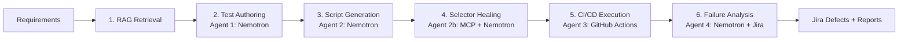

# Agentic AI STLC Pipeline

[](https://github.com/beepakbehera/agentic-ai-stlc-pipeline/actions/workflows/agentic_tests.yml)
[](https://www.python.org/downloads/)
[](https://nodejs.org/)
[](LICENSE)

> **Production-ready, modular AI-driven Software Testing Life Cycle (STLC) pipeline** powered by **LangGraph**, **NVIDIA Nemotron 3 Ultra 550B**, **Jira Cloud REST API v3**, and **GitHub Actions CI/CD**.

## 🎯 Overview

This pipeline automates the complete Software Testing Life Cycle using a multi-agent architecture:



### 6 Stages

| Stage | Agent | Technology | Purpose |
|-------|-------|------------|---------|
| 1 | RAG Retrieval | ChromaDB + Sentence Transformers | Retrieve relevant context from vector DB |
| 2 | Test Authoring | Nemotron 3 Ultra 550B | Generate comprehensive test cases |
| 3 | Script Generation | Nemotron 3 Ultra 550B | Generate Playwright TypeScript & Robot Framework |
| 4 | Selector Healing | MCP + Nemotron 3 Ultra 550B | Self-heal flaky selectors |
| 5 | CI/CD Trigger | GitHub Actions REST API | Dispatch & monitor workflow runs |
| 6 | Failure Analysis | Nemotron 3 Ultra 550B + Jira | Analyze failures & create defects |

## 🚀 Quick Start

### Prerequisites

- Python 3.11+
- Node.js 20+
- Git
- NVIDIA Nemotron API key ([get one](https://build.nvidia.com/explore/discover))
- Jira Cloud account with API token
- GitHub Personal Access Token

### Installation

```bash
# Clone repository
git clone https://github.com/beepakbehera/agentic-ai-stlc-pipeline.git
cd agentic-ai-stlc-pipeline

# Create virtual environment
python -m venv .venv
source .venv/bin/activate  # Windows: .venv\Scripts\activate

# Install Python dependencies
pip install -r requirements.txt

# Install Playwright browsers
playwright install --with-deps chromium

# Install Node.js dependencies
npm install
npx playwright install --with-deps chromium
```

### Configuration

```bash
# Copy environment template
cp .env.example .env

# Edit .env with your credentials
# Required: NEMOTRON_API_KEY, JIRA_*, GITHUB_TOKEN
```

### Run Pipeline

```bash
# Basic run with inline parameters
python main.py \
  --requirements "User login with email/password" \
  --acceptance-criteria "Valid credentials grant access; invalid show error" \
  --app-context "Web app at https://app.example.com"

# Run with config file
python main.py --config pipeline_config.json

# Ingest documents for RAG
python main.py --ingest-documents ./docs/

# Visualize pipeline graph
python main.py --visualize
```

## 📁 Project Structure

```
agentic-ai-stlc-pipeline/
├── .github/workflows/
│   └── agentic_tests.yml       # GitHub Actions CI/CD
├── config/
│   ├── settings.py             # Pydantic settings management
│   └── prompt_templates.py     # Nemotron prompts for all 4 agents
├── src/
│   ├── __init__.py
│   ├── state.py                # AgenticSTLCState TypedDict
│   ├── graph.py                # LangGraph compilation
│   ├── jira_client.py          # Jira REST API v3 wrapper
│   └── nodes/
│       ├── rag_retrieval.py    # Stage 1: Vector DB/RAG
│       ├── agent1_test_author.py      # Stage 2: Test Authoring
│       ├── agent2_script_gen.py       # Stage 3: Script Gen
│       ├── agent2b_mcp_heal.py        # Stage 4: Selector Healing
│       ├── agent3_cicd_trigger.py     # Stage 5: CI/CD Trigger
│       └── agent4_defect_logger.py    # Stage 6: Jira Defects
├── tests/
│   ├── e2e_sample.spec.ts      # Playwright sample
│   ├── sample.robot            # Robot Framework sample
│   ├── pages/                  # Page Objects
│   ├── fixtures/               # Test data
│   ├── resources/              # Robot keywords
│   └── variables/              # Robot variables
├── main.py                     # Entry point
├── requirements.txt            # Python dependencies
├── package.json                # Node.js dependencies
├── .env.example                # Environment template
└── .gitignore
```

## 🔧 Configuration

### Environment Variables

| Variable | Required | Description |
|----------|----------|-------------|
| `NEMOTRON_API_KEY` | ✅ | NVIDIA Nemotron API key |
| `JIRA_BASE_URL` | ✅ | Jira Cloud instance URL |
| `JIRA_EMAIL` | ✅ | Jira account email |
| `JIRA_API_TOKEN` | ✅ | Jira API token |
| `JIRA_PROJECT_KEY` | ✅ | Jira project key |
| `GITHUB_TOKEN` | ✅ | GitHub PAT with repo/workflow scopes |
| `VECTOR_DB_PATH` | | ChromaDB path (default: `./data/vector_db`) |
| `MCP_SERVER_URL` | | MCP server URL (default: `http://localhost:3000`) |
| `LOG_LEVEL` | | Logging level (default: `INFO`) |

### Pipeline Configuration

Create `pipeline_config.json`:

```json
{
  "requirements": "User login with email/password...",
  "acceptance_criteria": "Valid credentials grant access...",
  "application_context": "Web app at https://app.example.com",
  "git_ref": "main",
  "environment": "staging",
  "max_retries": 3,
  "pipeline_timeout": 3600
}
```

## 🤖 Agent Details

### Agent 1: Test Case Author
- **Model**: Nemotron 3 Ultra 550B
- **Input**: Requirements + Acceptance Criteria + RAG Context
- **Output**: Structured test cases (JSON) with priority, type, steps, tags
- **Features**: Gherkin format, risk-based prioritization, automation feasibility

### Agent 2: Script Generator
- **Model**: Nemotron 3 Ultra 550B
- **Input**: Test cases + Application context + Existing Page Objects
- **Output**: Playwright TypeScript + Robot Framework scripts
- **Features**: Page Object Model, data-testid selectors, fixtures, trace viewer

### Agent 2b: Selector Self-Healing
- **Model**: Nemotron 3 Ultra 550B + MCP Server
- **Input**: Failed selector + DOM snapshot + MCP alternatives
- **Output**: Healed selector + confidence score + code patch
- **Features**: Multi-strategy ranking, automated patch generation

### Agent 3: CI/CD Orchestrator
- **Model**: Nemotron 3 Ultra 550B
- **Input**: Workflow config + Test suite + Environment
- **Output**: Workflow execution results + artifact collection
- **Features**: Dispatch, monitor, retry flaky, collect reports

### Agent 4: Failure Analyst
- **Model**: Nemotron 3 Ultra 550B
- **Input**: Failure logs + Stack traces + Screenshots + Context
- **Output**: Root cause analysis + Jira defect (if product bug)
- **Features**: Classification (Bug/Script/Env/Flaky/Infra), evidence linking

## 🧪 Testing

### Run Playwright Tests
```bash
# All tests
npx playwright test

# Specific browser
npx playwright test --project=chromium

# With UI
npx playwright test --ui

# Generate report
npx playwright show-report
```

### Run Robot Framework Tests
```bash
# All tests
robot tests/sample.robot

# With specific browser
robot --variable BROWSER:firefox tests/sample.robot

# Output directory
robot --outputdir robot-results tests/sample.robot
```

### Run Pipeline Tests
```bash
# Unit tests
pytest tests/unit/ -v

# Integration tests
pytest tests/integration/ -v

# With coverage
pytest --cov=src --cov-report=html
```

## 📊 CI/CD Pipeline

The GitHub Actions workflow (`.github/workflows/agentic_tests.yml`) includes:

1. **Pipeline Execution** - Runs stages 1-4 (RAG → Test Authoring → Script Gen → Healing)
2. **Playwright Tests** - Parallel execution across Chromium, Firefox, WebKit
3. **Robot Framework Tests** - Alternative execution engine
4. **Failure Analysis** - Analyzes results, creates Jira defects
5. **Notifications** - Slack/Email/Teams integration

### Trigger Manually
```bash
gh workflow run agentic_tests.yml \
  -f test_suite=generated \
  -f environment=staging \
  -f run_id=abc123 \
  -f pipeline_id=stlc-20240115
```

## 🔐 Security

- All secrets managed via GitHub Secrets
- Jira uses Basic Auth (email + API token)
- GitHub token with minimal required scopes
- No credentials in code or logs
- `.env` file gitignored

## 📈 Monitoring & Observability

- **LangSmith** tracing (optional) for LLM calls
- **Structured logging** with structlog
- **GitHub Actions** workflow summaries
- **Jira** defect tracking with full context
- **Playwright** traces, screenshots, videos on failure

## 🛠 Development

### Code Quality
```bash
# Format
black src/ tests/
ruff check --fix src/ tests/

# Type check
mypy src/

# Pre-commit
pre-commit install
pre-commit run --all-files
```

### Adding New Stages
1. Create node in `src/nodes/`
2. Add to `src/graph.py` workflow
3. Update prompts in `config/prompt_templates.py`
4. Add tests in `tests/`

## 📝 License

MIT License - see [LICENSE](LICENSE) for details.

## 🤝 Contributing

1. Fork the repository
2. Create feature branch (`git checkout -b feature/amazing-feature`)
3. Commit changes (`git commit -m 'Add amazing feature'`)
4. Push to branch (`git push origin feature/amazing-feature`)
5. Open Pull Request

## 📧 Contact

**beepak.behera@gmail.com**

Project: [https://github.com/beepakbehera/agentic-ai-stlc-pipeline](https://github.com/beepakbehera/agentic-ai-stlc-pipeline)

---

*Built with ❤️ using LangGraph, Nemotron 3 Ultra, and GitHub Actions*